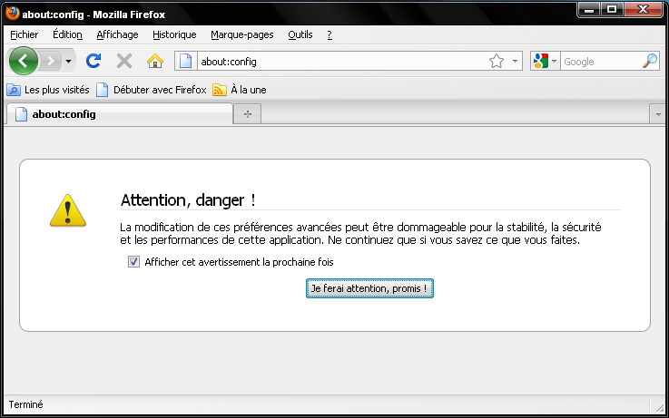
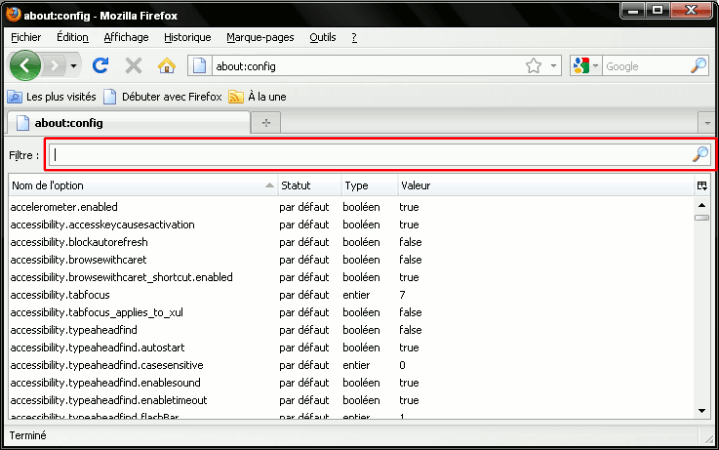
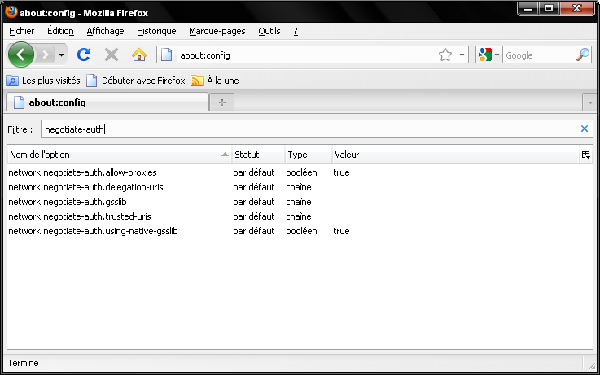
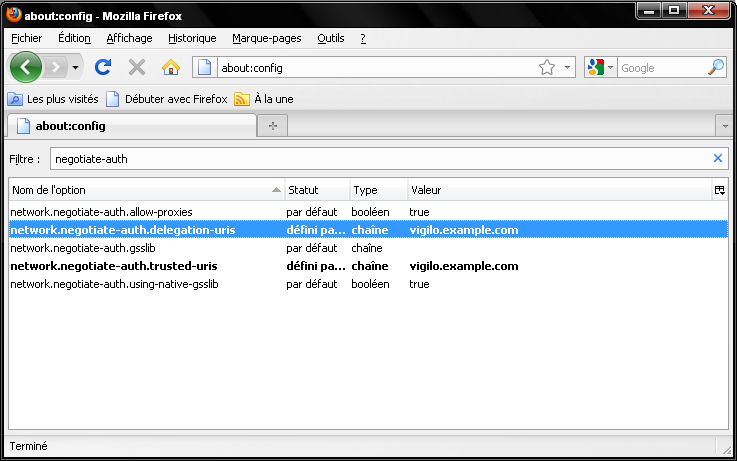
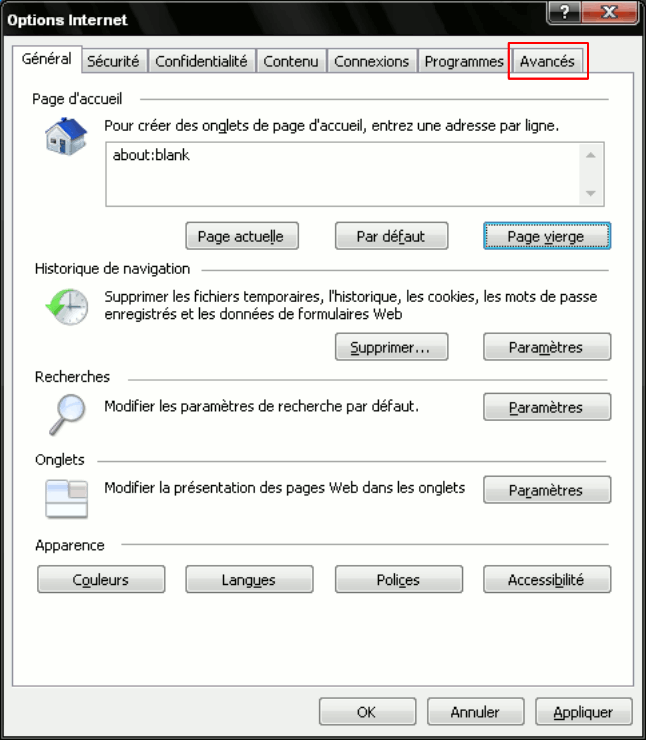
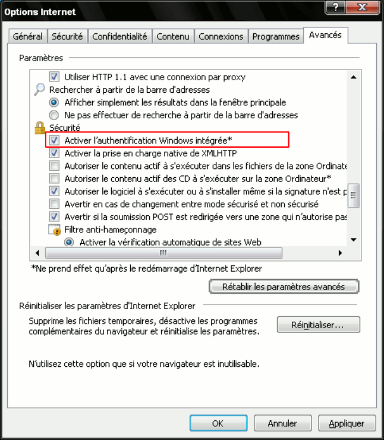

*********************************
Authentification et autorisations
*********************************

Installation
============

Pré-requis logiciels
--------------------
La configuration de l'authentification dans Vigilo nécessite l'installation des
logiciels suivants :

* python (>= 2.5), sur la machine à configurer
* ``vigilo-turbogears``, installé automatiquement par les interfaces web de
  Vigilo

Reportez-vous aux manuels de ces différents logiciels pour savoir comment
procéder à leur installation sur votre machine.

Le paquet ``vigilo-turbogears`` requiert également la présence de plusieurs
dépendances Python. Ces dépendances seront automatiquement installées en même
temps que le paquet ``vigilo-turbogears``.

Comptes par défaut
==================

Un compte par défaut est créé lors de l'installation de Vigilo, appelé
« manager ». Ce compte correspond à un utilisateur disposant de tous les droits
(super-utilisateur). Il n'a pas vocation à être utilisé en cours
d'exploitation, mais plutôt à permettre des interventions ponctuelles liées à
des tâches d'administration.

Le mot de passe par défaut de ce compte est ``iddad``. Ce mot de passe peut
être modifié depuis une machine sur laquelle Vigilo est installé, via la ligne
de commandes en exécutant la commande vigilo-passwd, à partir du compte de
l'utilisateur ``root``.

Phases de l'authentification
============================

Le mécanisme d'authentification de Vigilo repose sur le framework
``repoze.who``. La gestion des autorisations repose sur le framework
``repoze.what``.

Les interfaces graphiques de Vigilo utilisent les prédicats définies dans
``repoze.what`` afin de restreindre l'accès à certaines fonctionnalités. Ces
prédicats peuvent nécessiter que l'utilisateur soit authentifié, appartienne à
un groupe d'utilisateurs particulier ou dispose d'une permission spéciale. Ce
document ne revient pas sur ce mécanisme de gestion des autorisations mais
insiste plutôt sur l'authentification de l'utilisateur, qui permet d'établir
les groupes auxquels il appartient et les permissions dont il dispose. Le
lecteur pourra consulter la documentation du projet ``repoze.what`` pour plus
d'information sur les mécanismes d'autorisation consulter `la documentation de
Repoze <http://what.repoze.org/docs/1.0/>`_.  L'authentification se déroule en
plusieurs phases :

- phase de classification, qui permet de savoir d'où provient la requête en
  cours de traitement (par exemple, provient-elle d'un navigateur web ou
  s'agit-il d'une requête interne à Vigilo ?),
- phase d'identification, chargée de reconnaître l'utilisateur lorsqu'il se
  connecte,
- phase d'authentification, chargée de vérifier l'identité de l'utilisateur,
- phase de « challenge », permettant de demander des informations à
  l'utilisateur afin de l'authentifier,
- phase d'enrichissement à l'aide de fournisseurs de méta-données, permettant
  d'associer des méta-données à la session de l'utilisateur authentifié.

Fichier de configuration
========================

La configuration de l'authentification se fait en créant un fichier INI. Ce
fichier INI utilise le format suivant:

.. sourcecode:: ini
    :linenos:

    [plugin:foo]
    use = bar.baz.foo:FooPlugin
    param_foo_1 = valeur1
    param_foo_2 = valeur2

    [general]
    request_classifier = bar.baz:Classifier
    challenge_decider = bar.baz:Challenger

    [identifiers]
    plugins =
        foo

    [authenticators]
    plugins =
        foo

    [challengers]
    plugins =
        foo

    [mdproviders]
    plugins =
        foo

La documentation du framework ``repoze.who`` contient
`de plus amples informations <http://docs.repoze.org/who/1.0/narr.html#middleware-configuration-via-config-file>`_.

Lien avec les phases de l'authentification
------------------------------------------
Le contenu du fichier de configuration suit de près les différentes phases de
l'authentification. Tout d'abord, des modules sont configurés, à l'aide de
sections ``plugin:``, puis ceux-ci sont associés aux différentes étapes de
l'authentification à l'aide des sections ``identifiers`` (identification),
``authenticators`` (authentification), ``challengers`` (challenge) et
``mdproviders`` (fournisseurs de méta-données).

La section ``general`` contient la configuration pour l'étape de
classification, ainsi que des paramètres généraux, qui ne sont pas liés aux
différentes étapes.

La suite de ce document décrit plus en détail le contenu des différentes
sections du fichier de configuration.

Sections ``plugin:``
--------------------
Les sections dont le nom commence par ``plugin:`` correspondent à la
configuration d'un module qui pourra être utilisé dans le cadre de la
configuration de l'authentification. Le libellé après les deux points « : »
correspond à un alias qui sera affecté au plugin.

La clé ``use`` permet de spécifier l'emplacement de la fonction ou de la classe
Python implémentant le module. L'emplacement du module est donné en utilisant
la syntaxe : ``module.python:ClassOuFonction``. Les autres clés de la section
correspondent aux différents paramètres attendus par le module.

Tous les modules définis par défaut dans *repoze.who* sont utilisables ici
[#]_.

.. [#] La liste complète des modules est disponible à l'adresse :
   http://docs.repoze.org/who/1.0/narr.html#module-repoze.who.plugins.sql

Vigilo fournit également le module d'identification et d'authentification
``repoze.who.plugins.vigilo.kerberos:VigiloKerberosAuthenticator`` permettant
d'utiliser un annuaire LDAP et la méthode Kerberos pour l'authentification des
utilisateurs.

Sections ``identifiers``, ``authenticators``, ``challengers`` et ``mdproviders``
--------------------------------------------------------------------------------
Les sections ``identifiers``, ``authenticators``, ``challengers`` et
``mdproviders`` permettent de définir les modules à utiliser au cours des
phases décrites au chapitre `Phases de l'authentification`_.

Chacune de ces sections ne contient qu'une seule clé, appelée ``plugins``,
qui contient la liste des modules à appeler, à l'aide des alias définis pour
ces modules lors de leur configuration (voir le chapitre
`Fichier de configuration`_).

La liste des modules doit être écrites à la ligne, indentée, avec un module par
ligne. Il est possible de n'appliquer un module que pour une classification
particulière (voir la fonction ``request_classifier`` décrite dans la
`Section general`_ du chapitre `Fichier de configuration`_) en
suffixant le nom du module par « ; » suivi de la classification pour laquelle
il agit.

Exemple de configuration possible pour les ``challengers``:

.. sourcecode:: ini
    :linenos:

    [challengers]
    plugins =
        friendlyform;browser
        basicauth;vigilo-api

Ici, le module ``friendlyform`` est appelé lorsque la fonction de
classification attribue la classification ``browser`` à la requête, tandis
qu'elle appelle le module ``basicauth`` lorsque la classification renvoyée est
``vigilo-api``.

Section ``general``
-------------------
La section ``general`` contient deux options :

- ``request_classifier`` permet de classer les requêtes (par exemple, selon
  leur origine). Il s'agit d'une fonction qui sera appelée à chaque requête et
  renvoie une chaîne de caractères décrivant la classification de la requête.
  Cette fonction est indiquée en utilisant la même syntaxe que pour la
  définition des modules, à savoir : ``module.python:ClasseOuFonction``.

  Vigilo fournit la fonction
  ``vigilo.turbogears.repoze_plugins:vigilo_api_classifier`` qui permet de
  distinguer les requêtes provenant d'un navigateur web des requêtes provenant
  de l'API interne de Vigilo.

- ``challenge_decider`` permet de définir une fonction qui sera appelée pour
  décider si la requête actuelle nécessite d'obtenir de plus amples
  informations sur l'utilisateur afin de pouvoir l'authentifier. Si la réponse
  est positive, alors les plugins définis dans la section ``challengers`` sont
  utilisés.

  Vigilo utilise le module de challenge standard de ``repoze.who`` (implémenté
  par la fonction ``repoze.who.classifiers:default_challenge_decider``) pour
  décider si des informations supplémentaires sont nécessaires au traitement de
  la demande d'authentification.

Authentification externe
========================

Dans le cas où l'authentification doit se faire en utilisant une source externe
(ex : annuaire LDAP), la configuration du fichier de gestion de
l'authentification (who.ini) doit être adaptée, ainsi que la configuration des
diverses interfaces graphiques de Vigilo.

Dans ce chapitre, nous allons mettre en place une solution d'authentification
unique (Single Sign-On) basée sur l'utilisation de la méthode
d'authentification Kerberos auprès d'un annuaire LDAP.

On suppose que l'infrastructure nécessaire est déjà en place (un annuaire LDAP,
un KDC et éventuellement une PKI). On suppose également que l'annuaire LDAP
en place contient des informations sur les autorisations accordées aux
différents utilisateurs (par exemple, la liste des groupes auxquels un
utilisateur à accès, et donc les éléments du parc ou les applications qu'il
est susceptible de consulter).

Le chapitre `Configuration d'Apache avec Kerberos`_ donne un exemple de
configuration du module mod_auth_kerb d'Apache, permettant d'authentifier
les utilisateurs grâce à la méthode Kerberos.

Le chapitre `Adaptation du fichier who.ini`_ décrit les modifications apportées
au fichier who.ini afin d'utiliser le ticket Kerberos transmis par Apache au
sein des interfaces graphiques de Vigilo. Ce ticket sera notamment utilisé pour
interroger un annuaire LDAP et obtenir des informations sur l'utilisateur
actuellement connecté (nom complet, adresse email, groupes dont il est membre).

Enfin, le chapitre `Configuration du navigateur web des exploitants`_ décrit
la configuration à apporter au sein du navigateur web afin de permettre
l'utilisation de Kerberos comme méthode d'authentification.

Configuration d'Apache avec Kerberos
------------------------------------
Afin d'utiliser Kerberos comme méthode d'authentification, le module
``mod_auth_kerb`` d'Apache doit être configuré afin de pouvoir décoder le
ticket Kerberos transmis par le navigateur web des utilisateurs (voir aussi le
chapitre `Configuration du navigateur web des exploitants`_ pour la
configuration à apporter dans le navigateur web).

Le listing suivant montre comment charger le module ``mod_auth_kerb``
dans Apache pour activer le support de Kerberos:

.. sourcecode:: apache
    :linenos:

    <IfModule !mod_auth_kerb.c>
        LoadModule auth_kerb_module extramodules/mod_auth_kerb.so
    </IfModule>

Le chargement du module n'est fait que s'il n'était pas déjà chargé (cette
vérification est faite grâce à l'encapsulation dans la directive IfModule à la
ligne 1). La directive ``LoadModule`` à la ligne 2 donne le nom du point
d'entrée à charger dans le module (``auth_kerb_module`` dans le cas du
module mod_auth_kerb), ainsi que l'emplacement du module. Le module peut être
installé à un autre endroit sur la machine, en fonction de la distribution
Linux utilisée.

Une fois le module chargé, il faut adapter la configuration Apache des
différentes applications (fichiers « vigiboard.conf », « vigimap.conf » et
« vigigraph.conf » du répertoire /etc/httpd/conf.d/).

Le listing suivant donne un exemple de configuration de VigiBoard dans Apache
afin de gérer l'authentification Kerberos. Ce fichier se trouve dans
/etc/httpd/conf.d/vigiboard.conf:

.. sourcecode:: apache
    :linenos:

    <IfModule mod_wsgi.c>

        WSGISocketPrefix /var/run/wsgi
        WSGIRestrictStdout off
        WSGIPassAuthorization on
        WSGIDaemonProcess vigiboard user=apache group=apache processes=4 threads=1
        WSGIScriptAlias /vigilo/vigiboard "/etc/vigilo/vigiboard/vigiboard.wsgi"

        KeepAlive Off

        <Directory "/etc/vigilo/vigiboard/">
            <IfModule mod_headers.c>
                Header set X-UA-Compatible "IE=edge"
            </IfModule>

            <Files "vigiboard.wsgi">
                WSGIProcessGroup vigiboard
                WSGIApplicationGroup %{GLOBAL}
                <IfModule mod_authz_core.c>
                    # Apache 2.4
                    Require all granted
                </IfModule>
                <IfModule !mod_authz_core.c>
                    # Apache 2.2
                    Order Deny,Allow
                    Allow from all
                </IfModule>
            </Files>
        </Directory>

        <Location "/vigilo/vigiboard/login">
            AuthType kerberos
            AuthName "Kerberos"
            KrbServiceName HTTP
            KrbAuthRealms EXAMPLE.COM
            Krb5Keytab /etc/httpd/conf/HTTP.vigilo.example.com.keytab
            KrbMethodNegotiate on
            KrbMethodK5Passwd off
            KrbSaveCredentials on
            KrbVerifyKDC on
            Require valid-user
        </Location>

    </IfModule>

Avec cette configuration, seule l'URL
``http://vigilo.example.com/vigilo/vigiboard/login`` est protégée par une
authentification Kerberos. Les autres pages redirigent vers celle-ci
lorsqu'un utilisateur authentifié est attendu et que l'utilisateur courant
ne l'est pas. Cette solution offre le meilleur compromis possible entre la
sécurité (il n'est pas possible d'accéder à une ressource protégée sans être
authentifié) et les performances (une seule authentification par session).

La ligne 32 indique qu'Apache doit procéder à une authentification de type
« kerberos » afin d'autoriser l'accès à l'application (directive ``AuthType``).

La ligne 33 permet d'associer un nom à cette méthode d'authentification
(directive ``AuthName``). Ce nom apparaîtra dans les journaux d'événements du
serveur.

La ligne 34 spécifie le nom du service Kerberos qui sera utilisé pour procéder
à l'authentification (directive ``KrbServiceName``). La valeur par défaut est
« HTTP » qui correspond à la valeur recommandée.

La ligne 35 indique le nom du domaine Kerberos dans lequel l'authentification a
lieu (directive ``KrbAuthRealms``). Par convention, il s'agit du nom de domaine
du parc, **en majuscules**.

La ligne 36 spécifie l'emplacement du fichier contenant la clé secrète
d'authentification de ce service (directive ``Krb5Keytab``). Ce fichier
doit être accessible par le serveur web (et uniquement celui-ci).

La directive ``KrbMethodNegotiate`` à la ligne 37 autorise la négociation de
la méthode d'authentification entre le navigateur et le serveur web. Il est
recommandé d'autoriser la négociation.

La ligne 38 désactive l'authentification à la volée par identifiant/mot de
passe (directive ``KrbMethodK5Password``). Cette directive peut être positionnée
à « on » pour autoriser les utilisateurs à s'authentifier à la volée auprès du
serveur web. Si l'utilisateur tente de se connecter à l'application alors qu'il
ne dispose pas d'un ticket Kerberos valide, une boîte de dialogue l'invite à
saisir son identifiant et son mot de passe. La suite du processus
d'authentification se déroule alors comme si un ticket Kerberos avait été
transmis. Dans un environnement configuré pour n'utiliser que Kerberos (et ce
dès l'ouverture d'une session au démarrage des postes utilisateurs), il est
conseillé de positionner cette directive à « off ». Dans les autres cas, il est
recommandé de positionner cette directive à « on » pour permettre aux
utilisateurs ne disposant pas des outils nécessaires sur leur machine de
pouvoir s'authentifier malgré tout.

La directive ``KrbSaveCredentials`` à la ligne 39 permet de sauvegarder
temporairement le ticket Kerberos de l'utilisateur afin de permettre à
l'application d'interroger d'autres services en utilisant la méthode Kerberos.
Cette option est nécessaire dans les interfaces graphiques lorsque l'accès à
Nagios se fait via une authentification Kerberos, afin de propager le ticket
Kerberos reçu et maintenir la traçabilité des accès. Le fichier contenant le
ticket Kerberos est supprimé automatiquement à la fin de la requête.

La directive ``KrbVerifyKdc`` à la ligne 40 désactive la vérification de
l'identité du KDC du parc. Pour plus de sécurité, il est recommandé de
positionner cette directive à la valeur « on ». L'activation de cette option
nécessite cependant une configuration plus avancée de l'infrastructure
Kerberos, qui dépasse le cadre de ce document.

La directive ``Require`` (ligne 41) indique que l'utilisateur doit dispose
d'un compte valide dans la base Kerberos pour pouvoir accéder à l'application.

Adaptation du fichier who.ini
-----------------------------
La prise en charge de Kerberos comme méthode d'authentification dans Vigilo
se fait en paramétrant le fichier « who.ini » des interfaces graphiques
(VigiMap, VigiGraph et VigiBoard), selon la méthode présentée dans ce
chapitre. Lorsque Kerberos est utilisé comme méthode d'authentification,
l'identifiant Kerberos de l'utilisateur est transmis à l'application
au travers de la variable CGI ``REMOTE_USER``.

Le listing ci-dessous présente un exemple complet de configuration permettant
de synchroniser les comptes utilisateurs dans Vigilo avec un annuaire LDAP
externe, tout en utilisant l'identité Kerberos obtenue depuis le serveur web :

.. sourcecode:: ini
    :linenos:

    [plugin:auth_tkt]
    use = repoze.who.plugins.auth_tkt:make_plugin
    secret = vigilo
    cookie_name = authtkt

    [plugin:basicauth]
    use = repoze.who.plugins.basicauth:make_plugin
    realm=Vigilo

    [plugin:friendlyform]
    use = repoze.who.plugins.friendlyform:FriendlyFormPlugin
    login_form_url= /login
    login_handler_path = /login_handler
    logout_handler_path = /logout_handler
    rememberer_name = auth_tkt
    post_login_url = /post_login
    post_logout_url = /post_logout

    [plugin:ldapsync]
    use = vigilo.turbogears.repoze.plugins.mdldapsync:VigiloLdapSync
    ldap_url = ldap://ldap.example.com
    ldap_base = ou=people,dc=example,dc.com
    filterstr= (&(uid=%s)(objectClass=*))
    ldap_charset = cp1252
    http_charset = utf-8
    cache_name = vigilo
    binddn = mybinduser
    bindpw = mybindpassword
    attr_cn = cn
    attr_mail = mail
    attr_member_of = memberOf
    timeout = 3

    [plugin:externalid]
    use = vigilo.turbogears.repoze.plugins.externalid:ExternalIdentification
    rememberer = auth_tkt

    [general]
    request_classifier = vigilo.turbogears.repoze.classifier:vigilo_classifier
    challenge_decider = repoze.who.classifiers:default_challenge_decider

    [identifiers]
    plugins =
        friendlyform;browser
        basicauth;vigilo-api
        auth_tkt
        externalid;browser

    [authenticators]
    plugins =
        vigilo.turbogears.repoze.plugins.sqlauth:plugin

    [challengers]
    plugins =
        friendlyform;browser
        basicauth;vigilo-api

    [mdproviders]
    plugins =
        ldapsync
        vigilo.turbogears.repoze.plugins.mduser:plugin

Le module ``ldapsync`` (classe
``vigilo.turbogears.repoze.plugins.mdldapsync:VigiloLdapSync``) défini aux
lignes 19 à 31 est responsable de la récupération des informations depuis
l'annuaire LDAP à partir de l'identité Kerberos de l'utilisateur.

Les paramètres du module ``ldapsync`` sont les suivants :

``ldap_url``
    Emplacement de l'annuaire LDAP, sous la forme d'une URL. Exemple :
    ``ldap://ldap.example.com``.

``ldap_base``
    Base de recherche de l'utilisateur dans l'annuaire LDAP, sous la forme
    d'un Distinguished Name. Exemple : ``ou=People,dc=ldap,dc=example,dc=com``.

``filterstr``
    Filtre LDAP à appliquer aux résultats de la recherche.

    Exemple : ``(sAMAccountName=%s)``.

    Cette chaîne de caractères peut contenir la variable de substitution « %s »
    qui sera remplacée par l'identifiant Kerberos (principal) de l'utilisateur,
    privé du nom du domaine (par exemple : « vigilo » si le principal Kerberos
    est « vigilo\@EXAMPLE.COM »). La variable du substitution ne peut être
    utilisée qu'une seule fois.

    Par défaut, le filtre utilisé est ``(objectClass=*)``.

``ldap_charset``
    Encodage des caractères utilisé par l'annuaire. Cet encodage sera utilisé
    afin de décoder correctement les valeurs transmises par l'annuaire. Les
    noms d'encodages valides sont ceux définis par Python [#]_.

    Par défaut, l'encodage utilisé est ``utf-8``.

``http_charset``
    Ce paramètre est similaire au paramètre « ldap_charset » mais s'applique au
    serveur web. Il est utilisé afin de décoder correctement le principal
    Kerberos.

    Par défaut, l'encodage utilisé est « utf-8 ».

``cache_name``
    Nom d'une clé qui sera définie dans la session de l'utilisateur afin de
    stocker son identité.
    Les interfaces de Vigilo ne fonctionneront pas correctement si une valeur
    autre que ``vigilo`` est utilisée ici.

``binddn``
    DN (optionnel) à utiliser pour se connecter à l'annuaire LDAP (bind). Si ce
    paramètre n'est pas renseigné, le jeton Kerberos de l'utilisateur est
    transmis à l'annuaire afin de procéder à un bind par Kerberos (GSSAPI).

``bindpw``
    Mot de passe associé au DN indiqué dans le paramètre « binddn ».

``attr_cn``
    Nom de l'attribut (mono-valué) dans l'annuaire permettant d'obtenir le nom
    usuel (Common Name) de l'utilisateur. La valeur par défaut est « cn », ce
    qui correspond au nom de cet attribut dans un schéma LDAP classique.

``attr_mail``
    Nom de l'attribut (mono-valué) dans l'annuaire permettant d'obtenir
    l'adresse de courrier électronique de l'utilisateur. La valeur par défaut
    est « mail », ce qui correspond au nom de cet attribut dans un schéma LDAP
    classique.

``attr_member_of``
    Nom de l'attribut (multivalué) dans l'annuaire qui identifie les groupes
    dont l'utilisateur est membre. La valeur par défaut est « memberOf », ce
    qui correspond au nom de cet attribut dans un schéma LDAP classique.

``timeout``
    Délai d'expiration lors des opérations sur l'annuaire LDAP, en secondes.
    La valeur par défaut est 0, ce qui désactive le délai d'expiration.
    Il est recommandé de définir une valeur supérieure à zéro pour éviter
    tout risque de blocage de Vigilo lorsque l'annuaire LDAP ne répond plus.

Le module ``externalid`` (classe
``vigilo.turbogears.repoze.plugins.externalid:ExternalIdentification``) défini
aux lignes 34 à 36 est quant à lui utilisé pour mémoriser le fait que
l'utilisateur s'est authentifié à l'aide d'un mécanisme d'authentification
externe (ici, Kerberos) afin d'authentifier automatiquement cet utilisateur
lorsqu'il tente d'accéder à une page dont l'accès est restreint.

Les paramètres du modules ``externalid`` sont les suivants :

``rememberer``
    Nom d'une instance du module ``repoze.who.plugins.auth_tkt:make_plugin``
    qui sera chargée de mémoriser l'identité de l'utilisateur.
    Il s'agit d'un paramètre avancé. La valeur recommandée est ``auth_tkt``.

``strip_realm``
    Booléen qui indique si le royaume/domaine de l'utilisateur doit être
    retiré de son identifiant ou non avant l'import dans Vigilo.
    Si l'utilisateur ``foobar@EXAMPLE.COM`` s'authentifie auprès de Vigilo
    et que l'option est active, alors l'utilisateur sera importé en tant
    que ``foobar`` dans Vigilo. Sinon, il sera importé en tant que
    ``foobar@EXAMPLE.COM`` dans Vigilo.
    Cette option est activée par défaut.

La ligne 47 indique au framework d'authentification d'utiliser le
module d'authentification ``externalid`` défini plus haut, afin
d'authentifier automatiquement l'utilisateur s'il s'était identifié
au préalable auprès du serveur via Kerberos.

La ligne 60 permet quant à elle d'utiliser le module ``ldapsync`` afin de
synchroniser automatiquement la base de données Vigilo avec les informations
issues de l'annuaire LDAP lorsque l'utilisateur s'authentifie via un
mécanisme d'authentification externe (ici, Kerberos).

.. [#] http://docs.python.org/library/codecs.html#standard-encodings

Configuration du navigateur web des exploitants
-----------------------------------------------

Mozilla Firefox
^^^^^^^^^^^^^^^
L'activation de l'authentification par Kerberos dans Firefox se fait en
modifiant 2 options dans la configuration. La configuration actuelle de Firefox
peut être affichée en ouvrant un nouvel onglet, en tapant ``about:config``
dans la barre d'adresse et en validant.

Un message de mise en garde s'affiche, comme sur l'illustration intitulée
`Avertissement de Mozilla Firefox`_.

.. _`Avertissement de Mozilla Firefox`:

   Avertissement de Mozilla Firefox

Après prise en compte de l'avertissement (« Je ferai attention, promis ! »), la
configuration actuelle de Firefox s'affiche, comme sur l'illustration intitulée
`Options de configuration de Firefox`_.

.. _`Options de configuration de Firefox`:

   Options de configuration de Firefox

Dans la barre de filtrage des options (encadrée en rouge sur l'illustration
intitulée `Options de configuration de Firefox`_), saisir « negotiate-auth ».
Les paramètres actuels relatifs à l'authentification Kerberos (via le protocole
GSSAPI) s'affichent dans la zone de résultats, comme sur l'illustration
intitulée `Options relatives à l'authentification Kerberos`_.

.. _`Options relatives à l'authentification Kerberos`:

   Options relatives à l'authentification Kerberos

Les options à modifier, leur description et la valeur à utiliser sont
récapitulées ci-dessous :

network.negotiate-auth.delegation-uris
    Liste les adresses Internet pour lesquelles la délégation du ticket
    Kerberos est autorisée. La délégation du ticket doit être autorisée pour
    utiliser correctement les interfaces graphiques de Vigilo.

    Exemple : ``https://,vigilo.example.com``. Cette valeur autorise la
    délégation du ticket pour les sites utilisant une connexion chiffrée
    (HTTPS) *ou* à destination du serveur ``vigilo.example.com``.

network.negotiate-auth.trusted-uris
    Liste les adresses Internet pour lesquelles un ticket Kerberos doit être
    transmis.

    Exemple : ``https://,localhost,vigilo.example.com``. Cette valeur autorise
    la transmission du ticket aux sites utilisant une connexion chiffrée
    (HTTPS) *ou* à destination du serveur ``vigilo.example.com``.

L'illustration suivante montre un exemple de configuration autorisant
l'authentification Kerberos pour les sites hébergés par
``vigilo.example.com``.

.. _`Configuration autorisant l'authentification Kerberos vers Vigilo`:

   Configuration autorisant l'authentification Kerberos vers Vigilo

Microsoft Internet Explorer
^^^^^^^^^^^^^^^^^^^^^^^^^^^
Depuis Windows XP, la prise en charge de Kerberos dans Internet Explorer
nécessite uniquement l'activation du mécanisme d'Authentification Intégrée de
Windows.

L'activation se fait en allant dans le menu « Outil » et en sélectionnant
« Options Internet ». La boîte de dialogue des options d'Internet Explorer
s'ouvre alors (voir illustration intitulée
`Options de Microsoft Internet Explorer`_).

.. _`Options de Microsoft Internet Explorer`:

   Options de Microsoft Internet Explorer

Cliquer sur l'onglet « Avancées » (en rouge sur l'illustration intitulée
`Options de Microsoft Internet Explorer`_), puis faire défiler les options
jusqu'à trouver la ligne « Activer l'authentification Windows intégrée »
(encadrée en rouge sur l'illustration intitulée
`Activation de la prise en charge de Kerberos`_). L'option doit être
cochée pour que l'authentification par Kerberos soit supportée.

.. _`Activation de la prise en charge de Kerberos`:

   Activation de la prise en charge de Kerberos

Une fois la prise en charge de Kerberos activée, valider la modification en
cliquant sur le bouton « OK » et redémarrer Internet Explorer.

Vérification du bon fonctionnement
----------------------------------
La manière la plus simple de vérifier le bon fonctionnement de
l'authentification Kerberos consiste simplement à se connecter à l'une des
interfaces web de Vigilo.

Si vous ne disposez pas encore d'un ticket Kerberos valide et que la directive
``KrbMethodK5Passwd`` a été positionnée à « on » sur le serveur (voir le
chapitre `Configuration d'Apache avec Kerberos`_), une boîte de dialogue
vous invite à vous authentifier à l'aide de votre identifiant et de votre
mot de passe.

En revanche, si cette directive a été positionnée à « off », l'authentification
échoue et une page d'erreur apparaît dans le navigateur. Dans ce cas, vous
devez d'abord obtenir un ticket Kerberos pour accéder à l'application.

Sous Linux, vous pouvez obtenir un ticket Kerberos à l'aide de la commande
suivante::

    $ kinit -f <identifiant Kerberos>

L'option « -f » indique que le ticket peut être réutilisé par les services
auxquels vous vous connectez (délégation). Elle est nécessaire au bon
fonctionnement des interfaces de Vigilo.

Annexes
=======

Matrice des permissions associées aux applications
--------------------------------------------------

Le tableau suivant liste les permissions associées à chaque application avec leur rôle.

vigiboard-access
    Autorise l'utilisateur à se connecter à VigiBoard.

vigiboard-update
    Autorise l'utilisateur à mettre à jour des événements dans VigiBoard.

vigiboard-admin
    Autorise l'utilisateur à forcer l'état d'un événement du bac à « OK ».

vigiboard-silence
    Autorise l'utilisateur à consulter et à éditer les règles de mise en
    silence du bac à événements.

vigigraph-access
    Autorise l'utilisateur à se connecter à VigiGraph.

vigimap-access
    Autorise l'utilisateur à se connecter à VigiMap.

vigimap-edit
    Autorise l'utilisateur à accéder au Mode Édition de VigiMap (pour éditer les cartes).

vigimap-admin
    Autorise l'utilisateur à administrer les groupes de cartes.

Matrice des permissions sur les groupes de données
--------------------------------------------------
Vigilo permet, via l'interface VigiAdmin, d'accorder des permissions à un
utilisateur sur un groupe de données. Ces groupes de données peuvent être de
trois types :

- Groupes d'éléments supervisés (hôtes ou services),
- Groupes de cartes,
- Groupes de graphes.

Les accès accordés sont soit en lecture seule, soit en lecture/écriture.
Lorsqu'un accès est donné sur un groupe, il est également donné implicitement à
tous les descendants de ce groupe dans l'arborescence.

La signification de l'accès en lecture/écriture aux données varie selon le type
d'objet et l'interface manipulée. Le tableau suivant précise la signification
de chaque type d'accès, selon le type d'objet sur lequel il est appliqué et
l'interface de Vigilo consultée.

VigiBoard
    L'accès en lecture seule sur un groupe permet de voir les événements se
    rapportant aux hôtes ou aux services de ce groupe.  L'accès en
    lecture/écriture permet en plus de modifier le statut d'acquittement ou le
    ticket associé aux événements concernant des hôtes ou services du groupe
    [#]_.

VigiGraph
    Groupes d'hôtes ou de services : l'accès en lecture seule sur un groupe
    permet de voir les graphes se rapportant aux hôtes de ce groupe. L'accès en
    lecture/écriture confère les mêmes droits.

    Groupes de graphes : l'accès en lecture seule permet de consulter les
    graphes associés à ce groupe. L'accès en lecture/écriture [#]_ confère
    exactement les mêmes droits.

VigiMap
    Groupes d'hôtes ou de services : l'accès en lecture seule permet de voir
    les hôtes et services contenus dans le groupe et apparaissant sur une
    carte. Il permet également d'utiliser les hôtes et services contenus dans
    le groupe lors de la création ou de la modification d'une carte. L'accès en
    lecture/écriture confère les mêmes droits [#]_.

    Groupes de cartes : l'accès en lecture seule sur un groupe de cartes permet
    de consulter les cartes contenues dans ce groupe. L'accès en
    lecture/écriture permet en plus de créer ou de modifier des cartes dans ce
    groupe [#]_.

    Groupes de graphes : L'accès en lecture seule permet de voir les graphes
    associés au groupe lorsqu'ils sont utilisés sur une carte au travers d'un
    lien de type « service ». Il permet également d'utiliser ces graphes lors
    de la création ou de la modification d'une carte, au sein d'un lien de type
    « service ».  L'accès en lecture/écriture confère les mêmes droits [#]_.

.. [#] Pour le moment, l'accès en lecture seule est suffisant pour ça...
.. [#] L'accès en lecture seule ou en lecture/écriture devrait permettre
   de voir les graphes en question.
.. [#] Cette fonctionnalité n'est pas encore implémentée.
.. [#] Pour le moment, l'accès en lecture seule se comporte comme l'accès
   en lecture/écriture.
.. [#] Cette fonctionnalité n'est pas encore implémentée.

..  include:: glossaire.rst

.. vim: set tw=79 :
